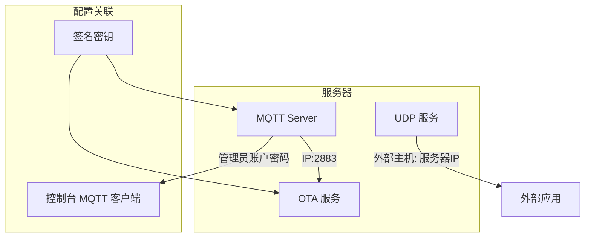

# ESP32 小智AI后端部署与使用指南
本指南提供了在ESP32上使用本项目作为后端的完整部署流程，包括服务器部署、设备配置和控制台配置三大部分。
## 1.服务器部署
服务器部署方式有两种，一种是本机部署，另一种方式是docker部署。
### Docker 部署
您可以通过以下两种方式进行 Docker 部署：
*   **方式一（推荐 - 包含控制台）**：[Docker Compose 快速入门 »](doc/docker_compose.md)
*   **方式二（纯服务，无控制台）**：[Docker 快速入门 »](doc/docker.md)

**重要说明：**
*   `docker-compose` 命令是一个独立于 Docker Engine 的工具。如果您使用的是较新版本的 Docker，也可以直接使用 `docker compose` 命令（`docker` CLI 的一个子命令），两者功能等效。

**服务端口映射说明：**
部署后，容器内的服务端口将映射到宿主机，默认配置如下：
*   **`8989:8989`**：WebSocket 服务端口。
*   **`2883:2883`**：MQTT 服务端口。
*   **`8888:8888/udp`**：UDP 服务端口。

### 本机部署
参考README.md

## 2.配置 ESP32 OTA 更新地址

ESP32 设备支持两种方式来配置 OTA 服务器的地址：

### 方式一：通过 WiFi 配网修改（适用于设备已部署后）

此方法需通过设备的 Web 配网界面进行修改。

**操作步骤：**
1.  启动 ESP32 设备，使其进入 WiFi 配网模式（表现为开启一个 AP 热点）。
2.  使用手机或电脑连接到此热点，并在浏览器中访问其配置页面（地址通常为 `192.168.4.1`）。
3.  在页面中找到 **OTA** 相关选项。
4.  将 OTA 服务器地址修改为：`http://<你的服务器IP>:8989/xiaozhi/ota/`
    **例如**：`http://192.168.1.12:8989/xiaozhi/ota/`
5.  保存配置并配网。

### 方式二：通过编译配置修改

此方法需要在重新编译 ESP32 的固件，修改项目配置文件来预置 OTA 地址。

**操作步骤：**
1.  在您的 ESP32 项目目录下，找到配置文件`config.json`的对应位置。
2.  添加或修改 OTA 服务器地址的配置项：
    ```json
    "CONFIG_OTA_URL": "http://<你的服务器IP>/xiaozhi/ota/"
    ```

## 3.控制台配置
### 服务配置


#### OTA配置
将签名密钥修改为mqtt server配置页面中的'签名密钥' 一致
可以选择是否启用MQTT配置，如果启用，MQTT端点设置为服务器IP:2883
#### MQTT配置
如果使用自带的MQTT代理，将Broker地址修改为127.0.0.1，端口号修改为2883
如果使用外部MQTT，请按需修改
将认证配置修改为 MQTT Server配置中的管理员账户及密码

#### MQTT Server配置
将监听端口设置为2883
设置管理员用户与密码
将签名密钥设置为ota配置页面签名密钥一致

#### UDP配置
将监听端口设置为8888
将外部主机设置为你的服务器ip，例如192.168.1.12
#### MCP配置
全局MCP服务器为外部MCP服务器，如没有外部MCP服务器可以暂时不配置

### AI配置

#### VAD配置
使用WebRTC VAD，无需外部配置
#### ASR配置
填写ASR的配置，即使是docker部署的服务器，也没有本地部署ASR，可以手动部署。
部署教程参考 [FunASR实时语音听写服务开发指南](https://github.com/modelscope/FunASR/blob/main/runtime/docs/SDK_advanced_guide_online_zh.md)
#### LLM配置
填写自己的APIKEY
#### TTS配置
注意事项，小智 TTS已经不能正常使用，推荐使用edge